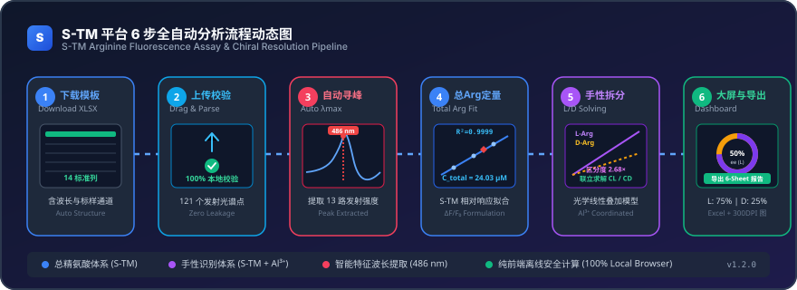

# S-TM Arginine Fluorescence Analysis Platform
## S-TM 荧光探针精氨酸检测与手性组成分析平台

[](https://react.dev/)
[](https://www.typescriptlang.org/)
[](https://vitejs.dev/)
[](https://tailwindcss.com/)
[](https://plotly.com/javascript/)
[](https://opensource.org/licenses/MIT)

> **Language / 语言切换**: [English](#english-version) | [中文说明](#中文说明文档)

---

## 🎬 Operational Workflow Animation / 操作流程动态演示

<div align="center">
  
</div>

---

<a name="english-version"></a>
## 🌐 English Version

### 📖 Background & Scientific Principle

1. **Probe Mechanism**: The fluorescent probe **S-TM** exhibits a pronounced fluorescence turn-on response upon binding to arginine (Arg). In the absence of metal ions, S-TM responds similarly to both L-Arg and D-Arg, making it ideal for **Total Arginine Quantification**.
2. **Chiral Discrimination with $\text{Al}^{3+}$**: Upon introduction of $\text{Al}^{3+}$, the resulting coordinated ternary complex $[\text{S-TM}\cdot\text{Al}^{3+}\cdot\text{Arg}]$ creates an asymmetric binding microenvironment. This induces distinct fluorescence sensitivities ($k_L \neq k_D$, typically $k_L / k_D \approx 2.7\times$), enabling precise **Chiral Quantification of L- and D-Arginine**.
3. **Simultaneous Chiral Solver**:
   $$\begin{cases} y_{unknown} = b + k_L C_L + k_D C_D \\ C_L + C_D = C_{total} \end{cases}$$
   Solving this system determines individual concentrations ($C_L, C_D$), enantiomeric excess ($ee$), and enantiomeric ratios with rigorous physical validity checks.

### 🌟 Key Features

- **Bilingual Interface**: Seamless one-click toggle between English and 中文 (Chinese) across all panels, charts, metrics, and guidance.
- **100% Client-Side Privacy**: All data processing, Excel parsing, and regression solving occur purely in the local browser. No experimental spectra are sent to external servers.
- **Official 14-Column Excel Template**: Built-in template generator (`.xlsx`) with automated data validation, non-numeric checks, and pinpoint error reporting.
- **Interactive Spectroscopy**: Publication-quality spectra visualization with Plotly.js, zoom, pan, hover tooltips, and 300 DPI PNG/SVG vector export.
- **Automatic Peak Finding**: One-click feature wavelength ($\lambda_{\max}$) detection with dynamic marker lines.
- **Dual Analytical Workflows**:
  - **Left Panel**: Total Arginine Standard Curve ($F$, $\Delta F$, $\Delta F/F_0$), $R^2$ quality control, and $C_{total}$ quantification.
  - **Right Panel**: L-Arg and D-Arg dual calibration curves, chiral discrimination factor ($k_L/k_D$), and simultaneous mass-balance chiral solver.
- **Chiral Results Dashboard**: Enantiomeric Excess ($ee$), dominant enantiomer tag, L/D ratio, donut composition chart, and concentration bar charts.
- **Scientific Rigor & Validation**:
  - **Mixture Validation Module**: Evaluate recovery rates and absolute/relative errors across pre-set (100:0, 75:25, 50:50, 25:75, 0:100) or custom ratios.
  - **Model Assumptions Documentation**: Clear presentation of linear dynamic range, optical superposition, and mass conservation constraints.
- **Comprehensive Excel Report Export**: One-click generation of a multi-tab scientific report (`Sample_Results`, `Extracted_Intensities`, `Total_Arg_Calibration`, `Chiral_Calibration`, `Mixture_Validation`, `Raw_Spectra_Data`).
- **Authentic Demo Data**: Pre-loaded simulated experimental dataset for immediate out-of-the-box demonstration.

### 📋 14-Column Data Format

The uploaded Excel sheet (`.xlsx` or `.xls`) must contain the following 14 columns:

| Col | Column Header | Description |
|:---:|:---|:---|
| 1 | `Wavelength (nm)` | Emission wavelength sequence |
| 2 | `S-TM` | Free probe blank |
| 3 | `S-TM + Arg Standard 1` | Total Arg standard 1 (e.g. 10 μM) |
| 4 | `S-TM + Arg Standard 2` | Total Arg standard 2 (e.g. 20 μM) |
| 5 | `S-TM + Arg Standard 3` | Total Arg standard 3 (e.g. 30 μM) |
| 6 | `S-TM + Unknown Sample` | Unknown sample in S-TM system |
| 7 | `S-TM + Al3+` | Probe + $\text{Al}^{3+}$ chiral baseline |
| 8 | `S-TM + Al3+ + L-Arg Standard 1` | L-Arg standard 1 (e.g. 10 μM) |
| 9 | `S-TM + Al3+ + L-Arg Standard 2` | L-Arg standard 2 (e.g. 20 μM) |
| 10 | `S-TM + Al3+ + L-Arg Standard 3` | L-Arg standard 3 (e.g. 30 μM) |
| 11 | `S-TM + Al3+ + D-Arg Standard 1` | D-Arg standard 1 (e.g. 10 μM) |
| 12 | `S-TM + Al3+ + D-Arg Standard 2` | D-Arg standard 2 (e.g. 20 μM) |
| 13 | `S-TM + Al3+ + D-Arg Standard 3` | D-Arg standard 3 (e.g. 30 μM) |
| 14 | `S-TM + Al3+ + Unknown Sample` | Unknown sample in S-TM + $\text{Al}^{3+}$ system |

### 🚀 Quick Start

```bash
# Clone the repository
git clone https://github.com/8lampard8/S-TM-Arginine-Fluorescence-Analysis-Platform.git
cd S-TM-Arginine-Fluorescence-Analysis-Platform

# Install dependencies
npm install

# Start development server
npm run dev
```

Visit `http://localhost:5173` in your browser.

---

<a name="中文说明文档"></a>
## 🇨🇳 中文说明文档

### 📖 研究原理与实验背景

1. **探针机理**：荧光探针化合物 **S-TM** 对精氨酸（Arg）产生明显的荧光点亮（Turn-on）响应。在不加入金属离子时，S-TM 对 L-Arg 和 D-Arg 的荧光响应差异微弱，因此用于建立标准曲线进行**总精氨酸定量检测**。
2. **Al³⁺ 协同诱导手性识别**：向 S-TM 体系中加入适量 $\text{Al}^{3+}$ 后，形成的三元配合物 $[\text{S-TM}\cdot\text{Al}^{3+}\cdot\text{Arg}]$ 构建了非对称的手性配位微环境，使得体系对 L-Arg 和 D-Arg 表现出显著不同的荧光响应灵敏度（$k_L \neq k_D$，本平台演示体系中 $k_L / k_D \approx 2.68\times$）。
3. **联立方程精确求解手性组成**：
   $$\begin{cases} y_{unknown} = b + k_L C_L + k_D C_D \\ C_L + C_D = C_{total} \end{cases}$$
   联立求解即可精准得出未知样中 L-精氨酸浓度 $C_L$、D-精氨酸浓度 $C_D$、摩尔占比、浓度比以及对映体过量值 $ee$。

### 🌟 核心功能特色

- **完整中英文双语支持**：顶部导航栏自带“中文 / English”一键切换按钮，涵盖图表、卡片、公式、设置项及说明的所有文本。
- **100% 浏览器本地离线运行**：数据完全在本地前端浏览器解析与计算，绝不上传任何服务器，严守科研数据私密性。
- **规范 14 列 Excel 模板**：一键生成带说明与波长序列的 `.xlsx` 模板，支持拖拽导入、严格列名与数值校验、前 5 行数据预览及报错精确定位。
- **交互式光谱图表与自动寻峰**：
  - 基于 Plotly.js 开发，支持悬停读数、局部缩放、坐标自适应及 300 DPI 矢量图导出。
  - 支持【自动寻峰 (λmax)】一键定位最大发射波长并提取各组荧光读数。
- **左右双栏定量分析**：
  - **左侧（总精氨酸）**：支持标准浓度动态配置、三种响应模式（$F$, $\Delta F$, $\Delta F/F_0$）、线性回归与 $R^2$ 质量评级、未知样总浓度 $C_{total}$ 与外推警示。
  - **右侧（手性定量）**：同图展示 L-Arg 与 D-Arg 双标准曲线、自动计算手性识别因子（$k_L/k_D$）、光学叠加联立求解、非物理解物理意义检验。
- **手性分析结果大屏**：
  - $C_L$、$C_D$、$C_{total}$、对映体过量值 $ee$ 及主导构型标签。
  - 摩尔组成环形图（Donut Chart）与浓度对比柱状图（Bar Chart）。
- **科研论文方法学验证（Mixture Validation）**：
  - 内置 100:0、75:25、50:50、25:75、0:100 标准比例矩阵与自定义比例添加，自动计算回收率（Recovery %）、绝对误差与相对误差。
- **多工作表科研级 Excel 报告导出**：
  - 一键导出包含 6 个独立工作表（Sample_Results、Extracted_Intensities、Total_Arg_Calibration、Chiral_Calibration、Mixture_Validation、Raw_Spectra_Data）的完整分析报告。
- **附带高拟真科研演示数据（Demo Data）**：
  - 打开网页即可一键体验完整分析闭环，无需繁琐准备测试数据。

### 📋 14 列数据格式规范

| 列号 | 列名 (Column Header) | 作用描述 |
|:---:|:---|:---|
| 1 | `Wavelength (nm)` | 荧光发射波长序列 |
| 2 | `S-TM` | 游离探针空白荧光光谱 |
| 3 | `S-TM + Arg Standard 1` | 总 Arg 标准浓度 1（如 10 μM） |
| 4 | `S-TM + Arg Standard 2` | 总 Arg 标准浓度 2（如 20 μM） |
| 5 | `S-TM + Arg Standard 3` | 总 Arg 标准浓度 3（如 30 μM） |
| 6 | `S-TM + Unknown Sample` | 未知样品在 S-TM 探针下的光谱 |
| 7 | `S-TM + Al3+` | 手性体系空白基线（S-TM + Al³⁺） |
| 8 | `S-TM + Al3+ + L-Arg Standard 1` | L-Arg 标准浓度 1（如 10 μM） |
| 9 | `S-TM + Al3+ + L-Arg Standard 2` | L-Arg 标准浓度 2（如 20 μM） |
| 10 | `S-TM + Al3+ + L-Arg Standard 3` | L-Arg 标准浓度 3（如 30 μM） |
| 11 | `S-TM + Al3+ + D-Arg Standard 1` | D-Arg 标准浓度 1（如 10 μM） |
| 12 | `S-TM + Al3+ + D-Arg Standard 2` | D-Arg 标准浓度 2（如 20 μM） |
| 13 | `S-TM + Al3+ + D-Arg Standard 3` | D-Arg 标准浓度 3（如 30 μM） |
| 14 | `S-TM + Al3+ + Unknown Sample` | 未知样品加入 S-TM 和 Al³⁺ 后的光谱 |

### 🚀 快速启动

```bash
# 1. 克隆代码仓库
git clone https://github.com/8lampard8/S-TM-Arginine-Fluorescence-Analysis-Platform.git
cd S-TM-Arginine-Fluorescence-Analysis-Platform

# 2. 安装依赖
npm install

# 3. 启动本地开发服务
npm run dev
```

在浏览器中访问 `http://localhost:5173` 即可使用。

---

## 📄 License
MIT License. 欢迎用于学术研究与科研论文数据处理。
